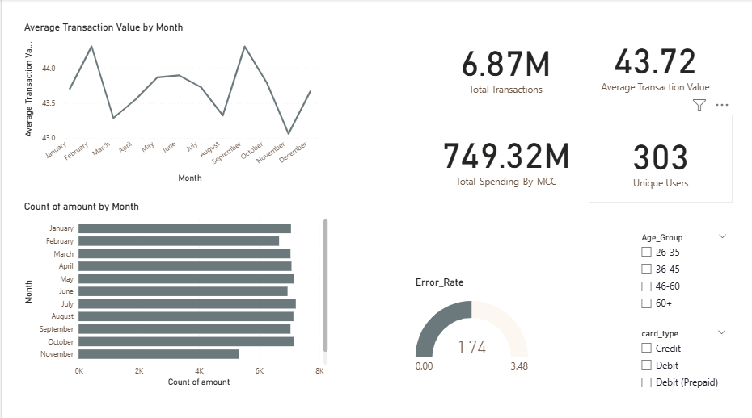

# Bank-Analysis-Dashboard

  

A finance dashboard made for a competiton of 365Bootcamp by power Bi. It includes basic analysis on 4 diefferent datasets and running some of DAX quries to get the valuable insights which help in different analysis.  
It is a dynamic dashboard which analyze different sales trends.  
It helps you to learn how data cleaning, and data visualiztion works in power BI and how different trend and columns relate with each other.

### To clone the project:
git clone https://github.com/Ayeshakhan77/Bank-Analysis-Dashboard

For any assistance reach me at ayeshawork51@gmail.com
